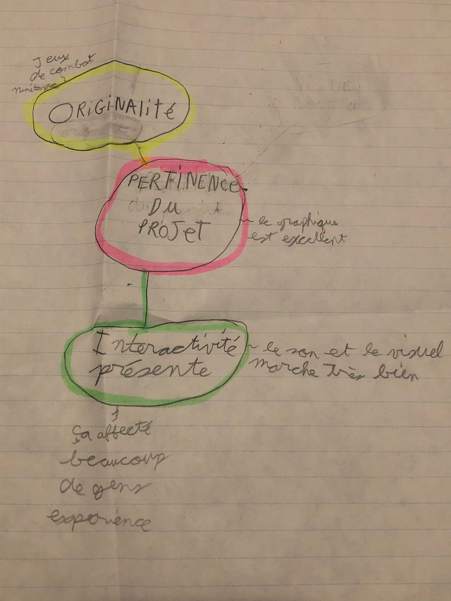

# Cours 11
## Plan de présentation 2 
Durée: 5 à 7 minutes

### Présentation
Le jeu vidéo créé par nintendo, par Masahiro Sakurai, Super Smash Bros Ultimate. Un jeu de combats sur plateforme avec la majorité des personnages de Nintendo. 

### Carte heuristique 

### Technologies
Le jeu se joue en 2D, mais les textures des plateformes et des personnages sont en 3D.

### Analyse critique
Faites une analyse critique du projet. En quoi est-il pertinent? Sur quels aspects pourrait-il être amélioré? Quels sont ses points forts? En quoi ce projet est-il original? 
Il est pertinent car c'est un bon divertissement qui réunie des gens pour s'amuser, pour devenir meilleur et atteindre des objectifs.
Le online devrait être amélioré, car il bug trop. C'est un bon gameplay il a plein de personnages, plusieurs maps, plusieurs mode tel: le mode classique, le mode histoire, le mode spécial... Ce projet est original, car diffère des autres jeux de combats dans lesquels plusieurs sont des combats avec une barre de vie, tandis que dans smash, le joueur meurt seulement si il est éjecté du terrain. Aussi, les personnages n'ont pas une barre de vie, mais un pourcentage, c'est-à-dire que plus le pourcentage est haut, plus ton personnage à de chance d'être propulser hors du terrain.
