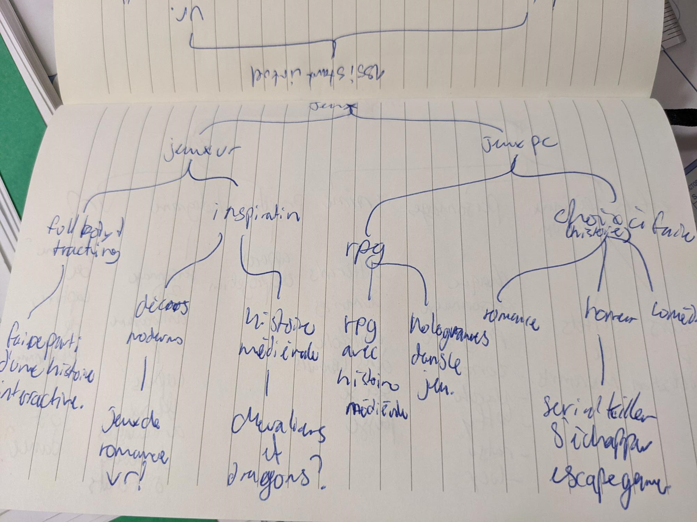
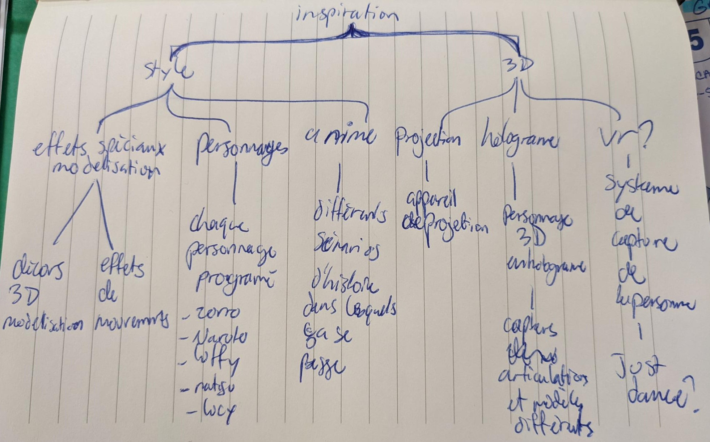

# Cours 13
## Préparation de la présentation 3 
Joindre des images de votre tempête d'idée et des esquisses de votre projet. Expliquer en 2 à 3 lignes votre projet. 
En gros, le projet c'est de faire un hologramme 3D de peronnages fictifs qui recopie nos mouvements. En faite, il y a une plateforme par terre dans lequel il capte et scanne nos mouvements qui est reproduit par l'hologramme que l'on aura choisie grâce à une tablette interactif. Aussi si le capteur reconnais un mouvement qui est attribué au personnages fictifs il risque de réagir à celui-ci. Par exemple, si tu choisie Naruto et que tu fais la technique Shadow Clone jutsu, il y aura d'autre hologramme de ce dernier qui vont apparaître.

