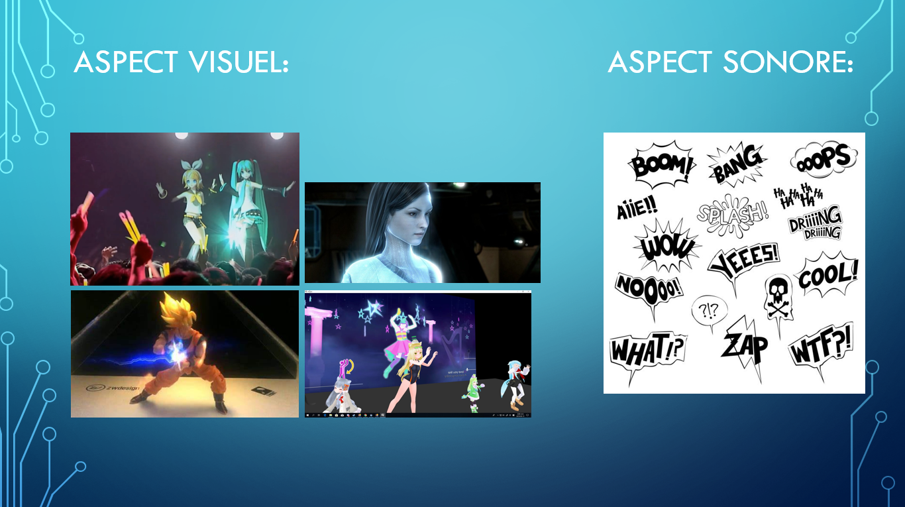

# Cours 14
## Plan de la présentation 3
Durée: 8 à 10 minutes

### Résumer votre projet en une phrase
Faire un hologramme interactif de personnage fictif qui recopie nos mouvements.

### Description du projet  
C'est un holograme interactif de personnage fictf qui recopie nos mouvements, on peut choisir ses derniers grâce à une tablette interactif. En gros c'est juste un divertissement qui peut être présenter dans une exposition. Aussi, il peu faire des effets spéciaux selon le mouvement qu'on produit, par exemple si on choisie Goku de Dragon ball et qu'on fait la posture Kamehameha, une boule d'énergie apparaîtera de ses mains.

### Schéma du projet ou scénarimage

### Moodboard

### Technologies 
En gros, il y a une plateforme par terre qui scane et capte nos mouvements qui sont ensuite reproduit par l'hologramme en face. Aussi, le produit est entièrement modélisé en 3D des pied jusqu'à la tête. De plus, les effets sonores sont synchronisés avec les mouvements du personnage. Finalement, il y aura aussi des effets spéciaux, dans lequel le programme va produire un effet selon le mouvement spécifique qu'on fait qui est relié au personnage.
### Étapes de réalisation 
Déjà il faut évaluer le budjet pour les droits d'auteurs des personnages ainsi que la création du produit. Concevoir un croquis du produit et développer une maquette. Réaliser avec toute les constituants du projet, le tester et le valider. Le présenter à la clientèle et voir si le produit les satisfaits.
